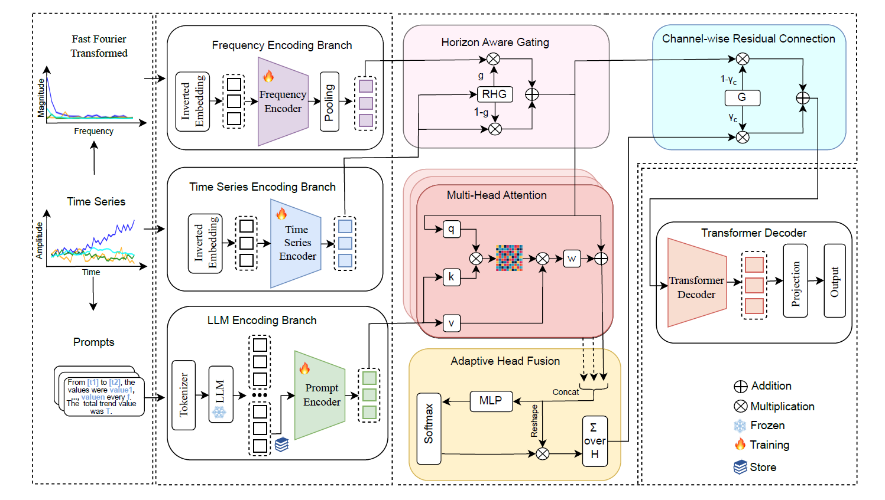

<div align="center">
  <!-- <h1><b> TimeCMA </b></h1> -->
  <!-- <h2><b> Time-CMA </b></h2> -->
  <h2><b> (AAAI'26) (Poster) T3Time: Tri-Modal Time Series Forecasting via Adaptive Multi-Head Alignment and Residual Fusion </b></h2>
</div>

[](https://www.arxiv.org/abs/2508.04251)

> If you find our work useful in your research. Please consider giving a star ⭐ and citation 📚:

 ```bibtex
@article{chowdhury2025t3time,
  title={T3Time: Tri-Modal Time Series Forecasting via Adaptive Multi-Head Alignment and Residual Fusion},
  author={Chowdhury, Abdul Monaf and Akter, Rabeya and Arib, Safaeid Hossain},
  journal={arXiv preprint arXiv:2508.04251},
  year={2025}
}
``` 

## Abstract
Multivariate time series forecasting (MTSF) seeks to model temporal dynamics among variables to predict future trends. Transformer-based models and large language models (LLMs) have shown promise due to their ability to capture long-range dependencies and patterns. However, current methods often rely on rigid inductive biases, ignore inter variable interactions, or apply static fusion strategies that limit adaptability across forecast horizons. These limitations create bottlenecks in capturing nuanced, horizon-specific relationships in time-series data. To solve this problem, we propose T3Time, a novel trimodal framework consisting of time, spectral, and prompt branches, where the dedicated frequency encoding branch captures the periodic structures along with a gating mechanism that learns prioritization between temporal and spectral features based on the prediction horizon. We also proposed a mechanism which adaptively aggregates multiple cross-modal alignment heads by dynamically weighting the importance of each head based on the features. Extensive experiments on benchmark datasets demonstrate that our model consistently outperforms state-of-the-art baselines, achieving an average reduction of 3.37% in MSE and 2.08% in MAE. Furthermore, it shows strong generalization in few-shot learning settings: with 5% training data, we see a reduction in MSE and MAE by 4.13% and 1.91%, respectively; and with 10% data, by 3.70% and 1.98% on average. Code is available at: https://github.com/monaf-chowdhury/T3Time

<p align="center">
  
</p>

## Dependencies

* Python 3.11
* PyTorch 2.1.2
* cuda 12.1
* torchvision 0.8.0

```bash
> conda env create -f env_windows.yaml
> conda install anaconda::h5py=3.12.1
# > conda install conda-forge::transformers=4.51.3
> pip install transformers==4.51.3
```

## Datasets
Datasets can be obtained from [TimesNet](https://drive.google.com/drive/folders/13Cg1KYOlzM5C7K8gK8NfC-F3EYxkM3D2) and [TFB](https://drive.google.com/file/d/1vgpOmAygokoUt235piWKUjfwao6KwLv7/view).

## Usages
* ### Last token embedding storage

```bash
bash Store_{data_name}.sh
```

* ### Train and inference
   
```bash
bash {data_name}.sh
```

## 📚 Documentation

详细的说明文档和教程请查看 [docs/](docs/) 目录：

- **技术原理**: FFT原理、频域处理机制等
- **使用指南**: 小波变换模型、实验记录系统等
- **系统配置**: 环境配置、嵌入版本管理等

快速开始请参考：[docs/QUICKSTART_WAVELET.md](docs/QUICKSTART_WAVELET.md)

## Contact Us
For inquiries or further assistance, contact us at [monafabdul15@gmail.com](mailto:monafabdul15@gmail.com) or open an issue on this repository.


